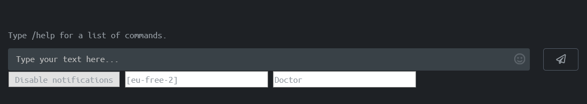

# HTBResetAlarm
JS which alerts you if someone has issued a reset to a specific machine and server on HackTheBox.

To use it, you go to the shoutbox page and copy to code into the browser console. By default it checks for resets every 5 seconds. It uses jQuery, and was written based on the classic HTB shoutbox page (not the new beta UI).

The script will also take care of enabling browser notifications for the shoutbox page in case you've never done that. If you deny the permission for notification by accident, you'll need to click on the icon near the HTTPS lock and remove the rule.

It should work on all recent browsers (not IE, you have bigger things to worry about if you use IE). On smartphone (why would you do that?) support is limited, check [here](https://developer.mozilla.org/en-US/docs/Web/API/Notifications_API/Using_the_Notifications_API#browser_compatibility) for details.

This is what you'll get:


One-liner
``` JS
var intervalHandle; function createComponents() { let componentsHTML='<div><button id="changeNotification" onclick="changeNotification()">Enable notifications</button><input id="serverName" type="text" placeholder="server e.g. [eu-free-2]" size="30"><input id="boxName" type="text" placeholder="Machine (case sensitive)" size="30"></div>'; $("div.panel-footer").append(componentsHTML); } function checkShoutbox() { let validAlerts=$( "p" ).children( "span.text-danger" ).filter( function(){ return $(this).prop("innerText") == "reset" && $(this).prop("seen")==undefined && $(this).siblings(".text-success").filter( function(){ return $(this).prop("innerText") == $("#serverName").prop("value"); }).length > 0 && $(this).siblings(".c-white").filter( function(){ return $(this).prop("innerText") == $("#boxName").prop("value"); }).length > 0; }); if(validAlerts.length>0){ let text = 'Some mad lad is trying to reset "your" box.'; let notification = new Notification('Box reset alarm', { body: text}); } validAlerts.each(function(){$(this).prop("seen", "True");}); } function enableAlerts(){ intervalHandle=setInterval(checkShoutbox, 5000); $("#changeNotification").html("Disable notifications"); } function disableAlerts(){ clearInterval(intervalHandle); $("#changeNotification").html("Enable notifications"); } function changeNotification() { if($("#changeNotification").prop("innerHTML")=="Enable notifications"){ if(Notification.permission === 'denied' || Notification.permission === 'default'){ askNotificationPermission(); return; } enableAlerts(); } else{ disableAlerts(); } } function askNotificationPermission() { function handlePermission(permission) { if(Notification.permission === 'denied' || Notification.permission === 'default') { $("#changeNotification").html("Enable notifications"); } else { enableAlerts(); } } if (!('Notification' in window)) { console.log("This browser does not support notifications."); } else { if(checkNotificationPromiseSupport()) { Notification.requestPermission() .then((permission) => { handlePermission(permission); }) } else { Notification.requestPermission(function(permission) { handlePermission(permission); }); } } } function checkNotificationPromiseSupport() { try { Notification.requestPermission().then(); } catch(e) { return false; } return true; } createComponents();
```
